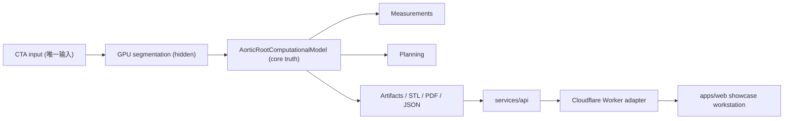

# AorticAI 系统架构

临床合理性检查维度：
- `sinus` 与 `annulus` 的关系是否自洽
- `STJ` 与 `sinus` 的关系是否自洽
- `commissure spacing` 是否临床上可接受
- `coronary heights` 是否可评估且可信

这些不是脱离上下文的机械硬门槛。系统会输出 `Normal / Borderline / Review Required / Not Assessable / Failed`，只有明显自相矛盾或无法支持结论时才进入硬失败。

默认病例链路：
- `case_manifest.json` 作为唯一真相
- `/api/cases/default_clinical_case/summary` 和 `/workstation/cases/default_clinical_case` 只能从它派生
- `planning.json` 作为 planning artifact 真相

GPU/CPU 分工：
- GPU：仅分割
- CPU：几何、测量、规划、模拟

未指定项：无特定约束。

## English summary

The default case is manifest-first. `case_manifest.json` is the only source of truth for default-case summary and workstation payloads. `planning.json` is the dedicated planning artifact. Anatomical checks are treated as layered clinical judgments rather than rigid boolean hard stops. GPU remains segmentation-only; geometry, measurements, planning, and simulation stay on CPU.
