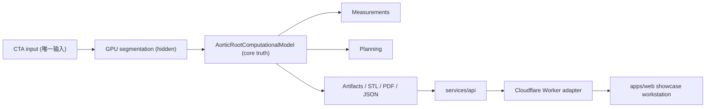

# AorticAI 系统架构

固定约束：
- `sinus >= annulus`
- `STJ <= sinus`
- `commissure spacing ≈ 120°`
- `coronary heights reasonable`

默认病例链路：
- `case_manifest.json` 作为唯一真相
- `/api/cases/default_clinical_case/summary` 和 `/workstation/cases/default_clinical_case` 只能从它派生
- `planning.json` 作为 planning artifact 真相

GPU/CPU 分工：
- GPU：仅分割
- CPU：几何、测量、规划、模拟

未指定项：无特定约束。

## English summary

The default case is manifest-first. `case_manifest.json` is the only source of truth for default-case summary and workstation payloads. `planning.json` is the dedicated planning artifact. GPU remains segmentation-only; geometry, measurements, planning, and simulation stay on CPU.
